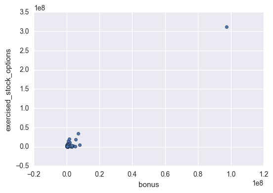
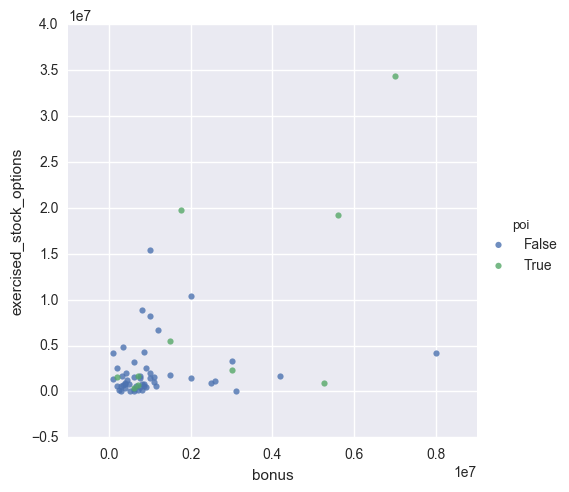
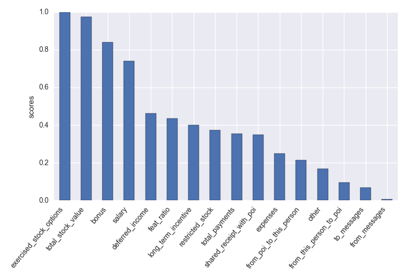

# Identifying Fraud From Enron Emails

## Question 1: Understanding the Dataset

*Summarize for us the goal of this project and how machine learning is useful in trying to accomplish it. As part of your answer, give some background on the dataset and how it can be used to answer the project question. Were there any outliers in the data when you got it, and how did you handle those?*  [relevant rubric items: "data exploration", "outlier investigation"]

The purpose of this project is to create a machine learning algorithm that correctly identifies persons of interest (POIs) implicated in the Enron fraud scandal using a subset of the emails in the [Enron Email Dataset](https://www.cs.cmu.edu/~./enron/).
Using the data contained in the certain features of the dataset, this algorithm will train on a subset of total individuals. Then it will create a model that will predict whether or not a given individual is a POI. We will fine-tune and modify the algorithm as needed to avoid bias and variance issues and evaluate the model for accuracy.

The dataset we are using is a dictionary of 146 individuals employed at Enron with 21 keys:

|key | non-null data type | non-null POIs |
|---|:---|---:|
|`bonus` | 82 integers | 16
|`deferral_payments` | 39 integers | 5
|`deferred_income` | 49 integers | 11
|`director_fees` | 17 integers | 0
|`email_address` | 111 strings | 18
|`exercised_stock_options` | 102 integers | 12
|`expenses` | 95 integers | 18
|`from_messages` | 86 integers | 14
|`from_poi_to_this_person` | 86 integers | 14
|`from_this_person_to_poi` | 86 integers | 14
|`loan_advances` | 4 integers | 1
|`long_term_incentive` | 66 integers | 12
|`other` | 93 integers | 18
|`poi` | 146 booleans | 18
|`restricted_stock` | 110 integers | 17
|`restricted_stock_deferred` | 18 integers | 0
|`salary` |  95 integers | 17
|`shared_receipt_with_poi` | 86 integers | 14
|`to_messages` | 86 integers | 14
|`total_payments` | 125 integers | 18
|`total_stock_value` | 126 integers | 18

The second column in the table above contains the number of individuals for whom each feature is not missing (marked `'NaN'`) and the third column contains the number of POIs in the second column. I calculated these quantities in `poi_id.py` by creating the dictionaries `nonnull_features` and `nonnull_poi_features`. Every feature has missing values except `poi`. Of the 21 feature entries identified in this dataset, 19 of them are non-empty for POIs.  

There are 18 POIs identified, and with the exception of `deferral_payments`, `director_fees`, `loan_advances`, and `restricted_stock_deferred`, more than half of the POIs have a given feature in their dictionary. Since the features named are those with very little information, we should not consider them as useful features for our analysis.

Let's take a look at the relationship between `exercised_stock_options` and `bonus` to find some outliers in our data. I first converted the data dictionary into a pandas dataframe and cleaned up null values.
```python
import pandas as pd
import seaborn as sns
import matplotlib.pyplot as plt
# create pandas dataframe of data_dict
df = pd.DataFrame(data_dict).transpose()
# clean up dataframe by converting `NaN` to np.nan
df = df.applymap(lambda x: np.nan if x == 'NaN' else x)

# remove initial outliers from dataframe
df = df[~(df.index == 'TOTAL') & ~(df.index.str.startswith('THE '))]
sns.lmplot('bonus', 'exercised_stock_options',
           data = df, hue = 'poi', fit_reg = False)
plt.show()
```


Notice there's a single large outlier in the upper right-hand order of the plot. A quick dictionary search reveals that this outlier is named `TOTAL`. This is not a real person, but a placeholder item with totals of all quantitative features, found at the bottom of the original financial spreadsheet `enron61702insiderpay.pdf`. Another interesting outlier I found in the spreadsheet is `THE TRAVEL AGENCY IN THE PARK`, which is also not a real person. This leaves us with 144 people in the dataset to work with.

Dropping these outliers and plotting `exercised_stock_options` vs. `bonus` once more, we get the following:



Persons of interest are labeled by green points. The biggest outliers found in the upper right corner of this plot are shown in the following table.

name | bonus |  exercised_stock_options |  poi
---| ---: | ---: | ---
LAY KENNETH L       | 7000000  |  34348384 | True
SKILLING JEFFREY K  | 5600000  |  19250000 | True

These are definitely outliers to keep because Kenneth Lay and Jeffrey Skilling are the founder and CEO of Enron respectively. Incidentally, the person with the largest bonus is `LAVORATO JOHN J`, who is not a person of interest, but someone we should keep because he is a legitimate Enron employee.


## Question 2: Optimizing Feature Selection and Engineering

*What features did you end up using in your POI identifier, and what selection process did you use to pick them? Did you have to do any scaling? Why or why not? As part of the assignment, you should attempt to engineer your own feature that does not come ready-made in the dataset -- explain what feature you tried to make, and the rationale behind it. (You do not necessarily have to use it in the final analysis, only engineer and test it.) In your feature selection step, if you used an algorithm like a decision tree, please also give the feature importances of the features that you use, and if you used an automated feature selection function like SelectKBest, please report the feature scores and reasons for your choice of parameter values.*  [relevant rubric items: "create new features", "properly scale features", "intelligently select feature"]

One feature that would be useful to create is the ratio of the number of non-null features to the total number of features for a given individual. This new feature, which I call `feat_ratio`, is a metafeature that tells how complete an individual's financial record is.
```python
feat_ratio = {}
# add feat_ratio to data_dict
for name, feature_dict in data_dict.items():
    # count number of features that aren't null for a given name
    num_nonnull = 0
    # loop over keys and values in features dictionary for a given name
    for key, value in feature_dict.items():
        if value != 'NaN':
            num_nonnull += 1
        elif key == 'feat_ratio':
            num_nonnull += 0

    # divide by number of features to calulate ratio
    feature_dict['feat_ratio'] = num_nonnull/21.
```

Now let us use a univariate feature selection algorithm to help us select the most salient features. For this project, I have opted to use `SelectKBest`, setting `k = 6` at first. This seems like a good number of features to start with to avoid high variance. Then I examined the scores I got for each of the features I've decided to keep so far.
```python
selector = SelectKBest(f_classif, k=6)
selector.fit(features,labels)

scores = selector.scores_
scores /= scores.max()

# use pandas Series to create a bar chart of KBest relative scores
fselect_series = pd.Series(scores, index = all_features)
fselect_series = fselect_series.sort_values(ascending = False).plot.bar()
plt.xticks(rotation = 50, ha = 'right')
plt.ylabel('scores')
plt.tight_layout()
plt.show()
```
Here are the results ordered by highest relative F-score.



The highest scoring features are `exercised_stock_options`, `total_stock_value`, `bonus`, `salary`, `deferred_income`, and `feat_ratio`. It turns out that `exercised_stock_options` and `total_stock_value` have a correlation coefficient of 0.964, so it would not be a good idea to include both in our final algorithm. So let us remove `total_stock_value`.

Here is the feature list:
```python
features_list = ['poi','exercised_stock_options', 'bonus',
                 'salary', 'deferred_income', 'feat_ratio']
```


## Question 3: Picking an Algorithm

*What algorithm did you end up using? What other one(s) did you try? How did model performance differ between algorithms?*  [relevant rubric item: "pick an algorithm"]

I tried out four different classifiers: random forest (`RandomForestClassifier`), decision tree (`DecisionTreeClassifier`), k-nearest neighbors (`KNeighborsClassifier`), and naive Bayes (`GaussianNB`). I split the data into training and test sets using `train_test_split` and measured how long it took to fit the training data. Then I used `cross_val_score` to calculate an average accuracy score from 10 cross validation splits.  Here are the performance results:

Algorithm | Fitting time (s) | Accuracy
:---|---:|---:
Random Forest | 0.036 | 0.877
Decision Tree | 0.001 | 0.800
K-Nearest Neighbors | 0.000 | 0.882
Naive Bayes | 0.001 | 0.875

So it looks like the random forest algorithm took the longest to fit, while the other three had substantially better performance. My final selection, `KNeighborsClassifier`, turns out to be the most accurate.


## Question 4: Tuning an Algorithm

*What does it mean to tune the parameters of an algorithm, and what can happen if you don’t do this well?  How did you tune the parameters of your particular algorithm? (Some algorithms do not have parameters that you need to tune -- if this is the case for the one you picked, identify and briefly explain how you would have done it for the model that was not your final choice or a different model that does utilize parameter tuning, e.g. a decision tree classifier).*  [relevant rubric item: "tune the algorithm"]

We tune the parameters of an algorithm so that we can find what parameters will optimize algorithm performance. If we do not do this well, our algorithm will not be as accurate as it could be had we used other parameter values.

But there are some algorithms, like `GaussianNB`, which do not have tunable parameters. In fact, using my feature selection, I was able to get the following scores with the `test_classifier` module in `tester.py` for this classifier:

Test | Value
:---|---:
Accuracy | 0.87007
Precision | 0.51839
Recall | 0.35950
F1 | 0.42456
F2 | 0.38298

However, I was able to get better performance by tuning the parameters of the `KNeighbors` classifier. Using `GridSearchCV`, I tested different parameter settings and improved most of my evaluation metric scores from default settings.
```python
# GridSearch for KNeighbors classifier
from sklearn.model_selection import GridSearchCV
params = [{'weights': ['uniform'],
          'n_neighbors': [3,4,5,6],
          'leaf_size': [i for i in xrange(10,31)],
          'p': [1,2]},
          {'weights': ['distance'],
           'n_neighbors': [3,4,5,6],
           'leaf_size': [i for i in xrange(10,31)],
           'p': [1,2]}]

kn_clf = GridSearchCV(clf_dict['KNeighbors'], params, cv = 10,
                        scoring = 'accuracy')
kn_clf.fit(features_train, labels_train)
kn_clf = kn_clf.best_estimator_
```

Here are the results from `test_classifier`:

Test | untuned | tuned
:--- | ---: | ---:
Accuracy | 0.89847 | 0.89427
Precision | 0.77830 | 0.67279
Recall | 0.33350 | 0.40300
F1 | 0.46692 | 0.50407
F2 | 0.37654 | 0.43814

While the accuracy and precision scores dropped for the tuned classifier, the recall score and hence the F1 and F2 scores rose.


## Question 5: Validating the Algorithm

*What is validation, and what’s a classic mistake you can make if you do it wrong? How did you validate your analysis?*  [relevant rubric item: "validation strategy"]

Validation is a necessary step to test a machine learning algorithm, where the data is split up into independent training and test sets. This is to correct for overfitting, where the model trains too closely on the input data so that accuracy drops precipitously when a new set of input data is introduced for the model to work on. By having an independent set on which to test, we will have a more accurate means to evaluate an algorithm's performance.

I employed validation in the algorithm selection phase. For each of the algorithms tests, I used `ShuffleSplit` to create 10 randomly split training/test set pairs, trained and tested the classifier, and calculated the mean accuracy score from the test sets.

```python
from sklearn.model_selection import train_test_split, cross_val_score, ShuffleSplit
features_train, features_test, labels_train, labels_test = \
    train_test_split(features, labels, test_size=0.3, random_state=42)

clf_dict = {"Random Forest": RandomForestClassifier(n_estimators = 10,
                                min_samples_split=25,
                                min_samples_leaf=1,
                                criterion="entropy"),
            "Decision Tree": DecisionTreeClassifier(max_depth = 7,
                                            max_features = 'sqrt',
                                            min_samples_split = 4),
            'Naive Bayes': GaussianNB(),
            'KNeighbors': KNeighborsClassifier()
            }

for name, clf in clf_dict.items():
    t0 = time()
    clf.fit(features_train, labels_train)
    print 'Fitting time: {} s'.format(round(time() - t0, 4))
    cv = ShuffleSplit(n_splits=10, test_size=0.3, random_state=42)
    scores = cross_val_score(clf, features, labels, cv = cv)
    print "{} mean accuracy for 15 CVs: {}".format(name, round(np.mean(scores), 3))
```

Results are presented in the table for Question 3.


## Question 6: Evaluating the Algorithm

*Give at least 2 evaluation metrics and your average performance for each of them.  Explain an interpretation of your metrics that says something human-understandable about your algorithm’s performance.* [relevant rubric item: "usage of evaluation metrics"]

As I showed in Question 4, my algorithm had a precision score of 0.67279 and a recall score of 0.40300. These are calculated from the cost matrix of true and false positive and negatives. A true positive in our case happens when our algorithm correctly predicts a POI from the features data, and a false positive happens when our algorithm incorrectly identifies a POI (`poi = True` when actually `poi = False`). Similarly, a true negative is a correctly identified non-POI and a false negative is an incorrectly identified non-POI (`poi = False` when actually `poi = True`). Here is the breakdown of total observations using `tester.py`.

```
Total predictions: 15000
True positives:      806
False positives:     392
False negatives:    1194
True negatives:    12608
```

Precision is the number of true positives divided by the sum of true positives and false positives. It is the fraction of true positive predictions given all positive predictions. A precision score of 0.67 tells us that 67% of our POI predictions were correctly identified as POIs.

Recall is the number of true positives divided by the sum of true positives and false negatives. Our score of 0.40 says that 40% of our predictions (POI or non-POI) are correctly identified. Given how many more non-POIs vs. POIs there are (126 vs. 18 respectively), there are bound to be many false negatives. Recall tells us how complete our predictions are.
